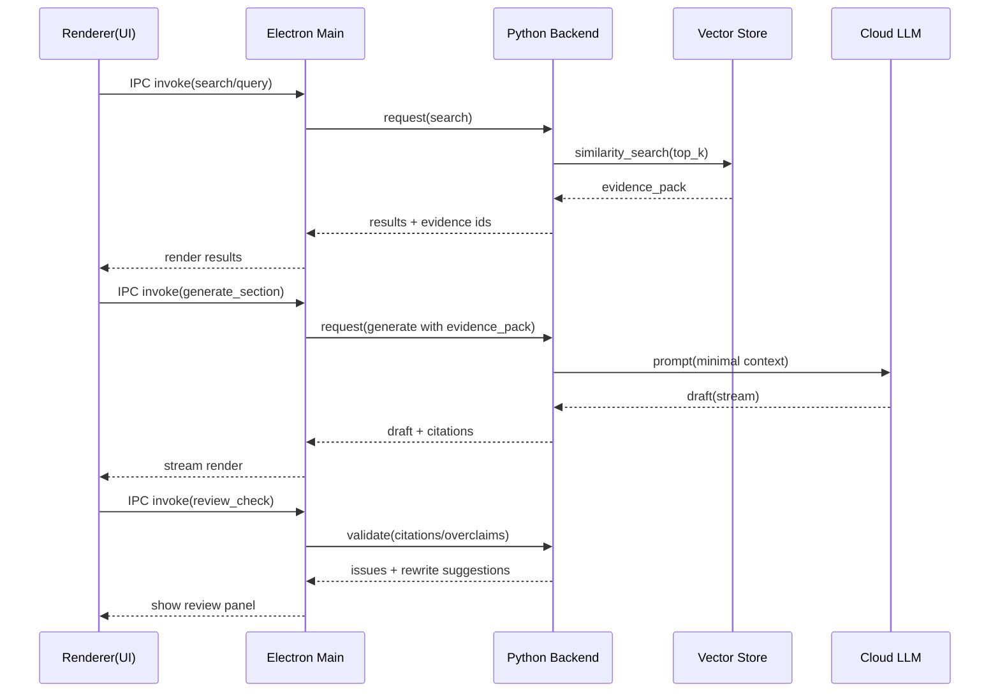

# Electron + Vue 3 + TypeScript + Python 本地后端技术架构提示词体系

## 技术架构目标与核心需求分析

这套提示词体系面向“桌面端本地优先 + 云模型增强”的工程形态：前端为 Electron + Vue 3 + TypeScript（渲染层），本地后端为 Python（承载 AI/RAG 管线、文档解析、索引与缓存），并可选本地向量数据库与线上 OpenAI 兼容模型接口。体系目标是让模型**持续输出高质量、结构化、可落地、可评审、可迭代**的架构方案，而不是“给一张漂亮图”。

架构设计需要同时覆盖业务目标、技术约束、非功能指标（NFR），并把“关键技术挑战”显式化，否则模型很容易产出泛化、不可交付的建议。建议你在系统里把目标与验收标准固化为“架构生成的硬性产物”。

业务目标（提示词必须可追溯到这些目标）：
- 提升端侧生产效率：导入、检索、生成、审阅的链路可视化、可恢复、可缓存。
- 可靠与可审阅：生成内容可追溯（证据/来源/版本）、风险可识别、决策可解释（ADR）。
- 企业可交付：跨平台安装与更新可控；不依赖 Docker；能在内网、代理、软件白名单环境运行。

技术约束（提示词中必须每次明确）：
- Electron 渲染层应视为不可信环境：不持有密钥、尽量不直接访问高权限资源。
- Python 为本地可信执行单元：负责模型调用、向量检索、文件系统访问、缓存与审计。
- 本地存储默认不外传：云模型仅接收“最小必要上下文”。  
- 混合栈可维护：接口契约版本化、向量库/模型供应商可替换、数据迁移可回滚。

非功能需求（验收标准示例，可按项目调整）：
- 启动：冷启动 ≤ 5s；Python 后端就绪 ≤ 3s（可后台完成）。
- 检索：首屏检索 P95 ≤ 300ms（本地）。
- 生成：首 token ≤ 3s（云端条件下），失败可重试可降级。
- 稳定性：后端崩溃可自动重启；任务可恢复；数据有一致性校验与备份策略。
- 安全：密钥不进渲染层；IPC/本地服务有鉴权与最小权限；日志脱敏；可选审计级别。

## 标准上下文与输出契约

为了让提示词“工程化可用”，强烈建议采用两件套：**标准上下文包（Architecture Context Pack）** + **统一输出契约（JSON + Mermaid）**。模型的作用是把上下文包转化为结构化架构产物；如果上下文缺失，必须返回 `clarifying_questions`，禁止擅自假设。

标准上下文包建议作为每次调用的固定输入（由前端或 Python 后端生成/合并），示例（可直接复制改造）：

```json
{
  "product": {
    "name": "标书生成桌面工具",
    "workflows": ["导入RFP与资料", "检索复用", "生成草稿", "引用追溯", "审阅导出"],
    "user_roles": ["架构师", "标书撰写", "审阅", "安全", "运维"]
  },
  "targets": {
    "platforms": ["Windows", "macOS", "Linux"],
    "enterprise_constraints": ["不可用Docker", "内网代理", "需要代码签名/白名单", "离线安装包优先"]
  },
  "frontend": {
    "stack": "Electron + Vue 3 + TypeScript",
    "security_defaults": {"contextIsolation": true, "nodeIntegration": false},
    "ui_scope": ["大文档预览", "任务队列", "引用高亮", "模板编辑"]
  },
  "backend": {
    "language": "Python 3.11+",
    "why_python": ["文档解析生态", "AI/RAG库生态", "任务编排与缓存"],
    "packaging": ["单可执行优先", "按平台构建产物"]
  },
  "data_profile": {
    "documents_count": 5000,
    "avg_doc_size_mb": 2,
    "chunking": {"size_tokens": 700, "overlap_tokens": 120},
    "embedding_dim": 1536,
    "expected_qps": 2
  },
  "nfr": {
    "startup_sec": 5,
    "backend_ready_sec": 3,
    "search_p95_ms": 300,
    "first_token_sec": 3,
    "memory_budget_mb": 1500,
    "disk_budget_gb": 10
  },
  "storage": {
    "vector_candidates": ["sqlite-vec", "LanceDB", "Qdrant(local)", "Qdrant(server)"],
    "metadata_store": "SQLite",
    "backup_policy": "支持用户一键导出"
  },
  "llm": {
    "type": "OpenAI-compatible",
    "endpoint_mode": ["direct", "proxy"],
    "retry_policy": "exponential backoff",
    "caching": ["embeddings", "retrieval", "drafts"],
    "data_policy": "仅发送 top-k 片段 + 必要指令"
  },
  "security": {
    "sensitivity": ["商业机密", "可能包含个人信息"],
    "secrets_storage": ["OS keychain/credential vault"],
    "audit_level": "basic"
  }
}
```

统一输出契约建议固定为 JSON（便于前端渲染、后端存储、版本 diff、自动测试），并允许在字段中携带 Mermaid 字符串：

```json
{
  "summary": "一句话结论",
  "architecture": { "components": [], "interfaces": [], "data_flows": [], "deployment": {} },
  "options": [{ "name": "", "pros": [], "cons": [], "fit": "" }],
  "decision": { "choice": "", "rationale": "", "tradeoffs": [] },
  "risks": [{ "risk": "", "impact": 0, "likelihood": 0, "mitigation": "" }],
  "assumptions": [],
  "clarifying_questions": [],
  "artifacts": { "mermaid_component": "", "mermaid_sequence": "", "adr_draft": "" }
}
```

## 关键模块结构化提示词模板库

下面给出一套“模块化提示词模板”，每个模板都包含：输入变量说明、输出结构定义、示例提示词文本。实现时建议把它们注册到 `prompts/architecture.yaml`，由 Python 后端渲染变量后调用模型，并用 JSON Schema/Pydantic 校验输出。

为保证一致性，所有模板默认叠加同一个全局系统约束（SYS），并强制输出 JSON。

### 全局系统约束模板（SYS-000）

**用途**：统一边界、安全、结构化输出、禁止空泛。  
**输入变量**：无（固定文本）。  
**输出结构**：无（约束性）。  

```text
【SYSTEM | SYS-000】
你是“桌面端架构设计助手”，目标是为 Electron + Vue 3 + TypeScript 前端与 Python 本地后端生成可落地的架构方案。

硬性规则：
1) 不得凭空假设未提供信息；缺信息必须输出 clarifying_questions。
2) 输出必须可落地：组件职责、接口契约、数据流、失败恢复、性能与容量考虑、权衡对比与风险登记。
3) 安全边界：渲染层不持有密钥；特权操作（文件/网络/向量库写入/模型调用）只在 Main/Python 执行；IPC/本地端口必须鉴权与最小权限。
4) 只输出符合指定 JSON 结构的内容，不输出多余解释文字。
5) 至少给出 2 个备选方案对比，再给出推荐方案与理由。
```

---

### 架构目标与验收标准提炼（ARCH-010）

**使用场景**：将上下文包转为“架构简报（Brief）”，作为后续所有模块设计的统一依据。  
**输入变量**：`ARCH_CONTEXT_PACK_JSON`  
**输出结构**（JSON）：
- `goals[]`、`constraints[]`、`nfrs[]`（含优先级）
- `key_decisions[]`（IPC、向量库、打包、模型适配、安全）
- `unknowns[]`、`clarifying_questions[]`

```text
【DEVELOPER | ARCH-010】
任务：从 Architecture Context Pack 提炼“业务目标、技术约束、NFR、关键决策点、未知项”，形成可评审的 Architecture Brief。

输入：
{{ARCH_CONTEXT_PACK_JSON}}

输出 JSON（字段必须齐全）：
{
  "goals": ["..."],
  "constraints": ["..."],
  "nfrs": [{"metric":"startup_sec","target":"<=5","priority":"P0"}],
  "key_decisions": ["IPC机制", "向量库存储", "Python打包", "模型适配层", "安全与权限"],
  "unknowns": ["..."],
  "clarifying_questions": ["..."]
}
```

---

### 前端渲染层（FE-100）

**关注点**：组件划分、状态管理、性能优化、与主进程通信接口。  
**输入变量**：`ARCH_BRIEF_JSON`、`UI_SCOPE_JSON`、`API_CONTRACT_HINTS_JSON`（可选）  
**输出结构**：
- `frontend_modules[]`（路由/职责/依赖）
- `state_model`（stores、events、持久化策略）
- `ipc_api_contract[]`（方法签名、参数/返回 schema、错误码）
- `performance_plan[]`（预算、策略、测量方法）
- `risks[]`

```text
【DEVELOPER | FE-100】
任务：设计 Electron Renderer（Vue 3 + TypeScript）架构，必须覆盖：
- 模块/页面拆分、领域组件划分
- 状态管理与事件流（含任务队列、检索结果、草稿版本、错误态）
- 与 Main 进程通信的接口设计（方法、类型、错误码、重试）
- 大文档渲染与引用高亮性能方案（虚拟列表/懒加载/分段渲染策略）
- 关键风险与缓解（例如 UI 阻塞、内存膨胀、渲染安全）

输入：
Architecture Brief:
{{ARCH_BRIEF_JSON}}

UI范围：
{{UI_SCOPE_JSON}}

输出 JSON：
{
  "frontend_modules": [{"name":"","routes":[],"responsibilities":[],"dependencies":[]}],
  "state_model": {"stores":[],"events":[],"persistence":{"what":"","where":"","when":""}},
  "ipc_api_contract": [{"method":"","params_schema":{},"returns_schema":{},"error_codes":[]}],
  "performance_plan": [{"topic":"大文档预览","budget":"<200ms交互响应","strategy":"","measurement":""}],
  "risks": [{"risk":"","impact":0,"likelihood":0,"mitigation":""}],
  "clarifying_questions": []
}
```

---

### 本地后端服务层（Python）（BE-200）

**关注点**：服务分层、任务调度、缓存策略、插件化（模型/向量库可替换）、可观测性。  
**输入变量**：`ARCH_BRIEF_JSON`、`VECTOR_OPTIONS_JSON`、`LLM_OPTIONS_JSON`  
**输出结构**：
- `layers[]`（API层/领域服务/数据访问/适配层/任务队列）
- `job_pipeline[]`（解析→分块→embedding→索引→检索→生成）
- `cache_design[]`（key、TTL、失效策略）
- `plugin_interfaces[]`（向量库、LLM、解析器）
- `observability`（日志、trace_id、诊断项）
- `risks[]`

```text
【DEVELOPER | BE-200】
任务：设计 Python 本地后端架构，必须满足可维护与可替换性：
- 分层：API层/领域服务层/数据访问层/适配层/任务调度
- 任务编排：导入解析、分块、embedding、索引构建、检索、生成、导出
- 缓存策略：embedding/检索/生成缓存的键设计、TTL、失效与一致性
- 插件化：向量库与模型供应商可替换；解析器可扩展
- 可观测性：结构化日志、trace_id/job_id、错误分级；用户诊断包

输入：
{{ARCH_BRIEF_JSON}}
向量库选项：
{{VECTOR_OPTIONS_JSON}}
模型选项：
{{LLM_OPTIONS_JSON}}

输出 JSON：
{
  "layers": [{"name":"api","modules":[],"responsibilities":[]}],
  "job_pipeline": [{"job":"doc_import","steps":[],"idempotency":"","retry_policy":"","persistence":""}],
  "cache_design": [{"cache":"embedding","key":"hash(chunk_text)+model","ttl":"永久/版本化","invalidation":""}],
  "plugin_interfaces": [{"name":"vector_store_adapter","methods":[],"implementations":[]}],
  "observability": {"log_schema":{}, "trace_fields":["trace_id","job_id","doc_id"], "health_checks":[]},
  "risks": [],
  "clarifying_questions": []
}
```

---

### 进程间通信（IPC/REST/gRPC/stdio）（IPC-300）

**关注点**：Electron 与 Python 的通信选择、鉴权、性能、调试、崩溃恢复、协议版本化。  
**输入变量**：`ARCH_BRIEF_JSON`、`NFR_JSON`、`ENTERPRISE_CONSTRAINTS_JSON`  
**输出结构**：
- `options[]`（stdio JSON-RPC、REST、gRPC、renderer直连风险）
- `recommendation`（选择与理由）
- `message_or_api_spec`（消息 schema 或 endpoint 列表）
- `error_recovery[]`（崩溃、超时、重启、重放）
- `versioning`（协议版本、兼容策略）

```text
【DEVELOPER | IPC-300】
任务：为 Electron（Renderer/Main）与 Python 后端设计通信方案，并对比以下选项：
A) Main spawn Python + stdio JSON-RPC（无端口）
B) Python REST(127.0.0.1) + Main 代理转发（renderer 不直连）
C) Python gRPC + Main 代理转发
D) Renderer 直连本地服务（必须给出强风险说明与必要控制）

输入：
{{ARCH_BRIEF_JSON}}
性能目标：
{{NFR_JSON}}
企业约束：
{{ENTERPRISE_CONSTRAINTS_JSON}}

输出 JSON：
{
  "options": [{
    "name":"stdio-jsonrpc",
    "startup_time_estimate":"",
    "resource_estimate":"",
    "pros":[],
    "cons":[],
    "security_posture":{"auth":"","attack_surface":"","notes":""},
    "debuggability":"high|medium|low",
    "implementation_notes":[]
  }],
  "recommendation": {"choice":"","rationale":"","when_to_reconsider":""},
  "message_or_api_spec": {"protocol":"stdio|rest|grpc","definitions":[]},
  "error_recovery": [{"scenario":"python_crash","detection":"","recovery":"","user_ux":""}],
  "versioning": {"protocol_version":"1.0","compatibility_strategy":""},
  "risks": [],
  "clarifying_questions": []
}
```

---

### 数据存储与检索（DATA-400）

**关注点**：元数据管理、向量库选型、数据一致性、迁移与重建、备份恢复。  
**输入变量**：`ARCH_BRIEF_JSON`、`VECTOR_OPTIONS_JSON`、`DATA_MODEL_HINTS_JSON`（可选）  
**输出结构**：
- `data_model`（doc/chunk/embedding/task/draft/citation）
- `storage_components[]`（SQLite元数据、文件存储、向量索引、缓存）
- `consistency`（事务边界、幂等、删除与重建）
- `migration_plan[]`（schema 版本、重建策略、回滚）
- `backup_restore`（导出包、校验与自修复）

```text
【DEVELOPER | DATA-400】
任务：设计本地数据层（元数据 + 文件存储 + 向量索引 + 缓存），要求：
- 明确数据模型与主键策略（doc_id/chunk_id/version）
- 导入、更新、删除的事务边界与幂等策略
- 向量库选型对比与推荐（结合 Python 集成与桌面交付难度）
- schema 迁移与向量重建策略（在线/离线、回滚路径）
- 备份/恢复：用户一键导出、完整性校验、自修复策略

输入：
{{ARCH_BRIEF_JSON}}
向量库候选：
{{VECTOR_OPTIONS_JSON}}

输出 JSON：
{
  "data_model": {"entities":[{"name":"document","keys":["doc_id"],"fields":[]}]},
  "storage_components": [{"name":"sqlite_metadata","why":"","details":[]}],
  "consistency": [{"operation":"doc_import","atomic_writes":[],"idempotency":"","rollback":""}],
  "migration_plan": [{"version":"v2","change":"","strategy":"offline","rollback":""}],
  "backup_restore": {"backup_units":[],"restore_steps":[],"integrity_checks":[]},
  "risks": [],
  "clarifying_questions": []
}
```

---

### 模型调用接口与 OpenAI 兼容适配（LLM-500）

**关注点**：鉴权、延迟与重试、缓存、流式、最小外传、降级。  
**输入变量**：`ARCH_BRIEF_JSON`、`LLM_PROVIDER_JSON`、`DATA_POLICY_JSON`  
**输出结构**：
- `adapter_interface`（methods、schemas、streaming）
- `auth_strategy`（密钥存储位置、刷新/轮换）
- `retry_latency_policy`
- `privacy_controls`（脱敏、最小外传）
- `cache_strategy`
- `fallback_plan`（离线/云不可用降级）

```text
【DEVELOPER | LLM-500】
任务：设计 OpenAI-compatible 模型调用适配层，必须覆盖：
- 鉴权：密钥仅存于 Main/Python，渲染层不得接触；支持轮换
- 延迟与重试：超时、退避重试、幂等与请求追踪
- 流式输出：支持 token/段落流式回传给 UI（可选）
- 数据策略：最小外传（仅 top-k 片段 + 必要指令），可选脱敏
- 缓存与降级：缓存键、TTL、失效；云不可用时降级模式与 UX

输入：
{{ARCH_BRIEF_JSON}}
模型提供商信息：
{{LLM_PROVIDER_JSON}}
数据策略：
{{DATA_POLICY_JSON}}

输出 JSON：
{
  "adapter_interface": {"methods":[{"name":"generate","params_schema":{},"returns_schema":{}}], "streaming":"yes|no"},
  "auth_strategy": {"where_store_secrets":"","rotation":"","access_control":""},
  "retry_latency_policy": {"timeouts":{}, "retries":{}, "backoff":""},
  "privacy_controls": [{"control":"redaction","scope":"","implementation":""}],
  "cache_strategy": [{"layer":"draft_cache","key":"","ttl":"","invalidation":""}],
  "fallback_plan": [{"mode":"retrieval_only","user_message":"","limitations":[]}],
  "risks": [],
  "clarifying_questions": []
}
```

---

### 安全与权限管理（SEC-600）

**关注点**：信任边界、威胁模型（STRIDE）、密钥管理、审计日志、IPC 防护。  
**输入变量**：`ARCH_BRIEF_JSON`、`IPC_DESIGN_JSON`（可选）、`DATA_POLICY_JSON`  
**输出结构**：
- `trust_boundaries[]`
- `threat_model[]`（STRIDE）
- `secrets_management`
- `ipc_security_controls[]`
- `audit_logging`

```text
【DEVELOPER | SEC-600】
任务：输出桌面应用安全与权限方案，必须包含：
- 信任边界：Renderer/Main/Python/Storage/Cloud
- STRIDE 威胁模型：威胁、影响、概率、缓解与残余风险
- 密钥管理：存储位置、访问控制、轮换与审计
- IPC/本地服务安全：sender 校验、token、最小权限、端口策略（若有）
- 审计日志：事件清单、脱敏规则、保留策略、诊断包

输入：
{{ARCH_BRIEF_JSON}}
（可选）IPC 设计：
{{IPC_DESIGN_JSON}}
数据策略：
{{DATA_POLICY_JSON}}

输出 JSON：
{
  "trust_boundaries": [{"boundary":"renderer_untrusted","components":["Renderer"],"notes":""}],
  "threat_model": [{"threat":"IPC message spoofing","category":"STRIDE","impact":0,"likelihood":0,"mitigation":""}],
  "secrets_management": {"where_stored":"","access_control":"","rotation":"","audit":""},
  "ipc_security_controls": [{"control":"","implementation":"","residual_risk":""}],
  "audit_logging": {"events":[],"redaction_rules":[],"retention":""},
  "risks": [],
  "clarifying_questions": []
}
```

---

### 打包与运维（跨平台交付、自动更新、诊断与回滚）（OPS-700）

**关注点**：Electron 打包、Python 冻结/分发、版本兼容、自动更新与回滚、诊断包。  
**输入变量**：`ARCH_BRIEF_JSON`、`ENTERPRISE_CONSTRAINTS_JSON`  
**输出结构**：
- `packaging_strategy`（Electron、Python、共享资源）
- `versioning`（app/backend/protocol/schema）
- `update_flow[]`（成功/失败/回滚）
- `diagnostics`（健康检查、日志路径、支持包内容）
- `risks[]`

```text
【DEVELOPER | OPS-700】
任务：设计跨平台打包与运维方案，必须覆盖：
- Electron 主包：构建、签名、公证（如适用）、更新策略
- Python 后端：冻结打包/嵌入解释器/分层下载（结合企业离线要求）
- 版本管理：app/backend/protocol/schema 的兼容与回滚策略
- 自动更新与失败处理：更新失败、迁移失败的回退路径
- 诊断：健康检查、日志位置、用户一键导出诊断包（版本、配置、最近错误）

输入：
{{ARCH_BRIEF_JSON}}
企业约束：
{{ENTERPRISE_CONSTRAINTS_JSON}}

输出 JSON：
{
  "packaging_strategy": {"electron":"","python_backend":"","shared_assets":""},
  "versioning": {"app":"","backend":"","protocol":"","schema":""},
  "update_flow": [{"step":"","success_path":"","failure_path":"","rollback":""}],
  "diagnostics": {"health_checks":[],"log_locations":[],"support_bundle":[]},
  "risks": [],
  "clarifying_questions": []
}
```

## 不同技术角色的个性化提示词示例

以下示例可直接作为“用户输入层提示词”，系统会自动叠加 SYS-000 并注入上下文包或 Brief。关键是让角色关注点体现在**输出字段偏好、验收标准偏好与风险视角**上。

架构师（整体方案 + 权衡 + 风险）：
```text
请基于当前 Architecture Context Pack 生成端到端架构蓝图，要求：
- 必须给出 2 个 IPC 备选并推荐
- 向量库给出 2-3 个备选并说明桌面交付差异
- 输出必须包含 Mermaid 组件图与时序图
- 必须输出风险登记与 ADR 草案
按统一 JSON 契约输出。
```

后端开发（Python 分层、任务、缓存、接口）：
```text
请输出 Python 本地后端的模块划分与接口契约，重点：
- job_pipeline 必须覆盖导入解析→分块→embedding→索引→检索→生成→导出
- 每个 job 必须说明幂等键、重试策略、落盘点与恢复策略
- 设计缓存键（embedding/检索/草稿）与失效条件
- 输出 API spec（供 Main 调用）与错误码
按 JSON 输出（含可观测性字段与测试建议）。
```

前端开发（组件、状态、性能、IPC API 类型）：
```text
请输出 Renderer（Vue3/TS）架构方案：
- 路由/页面拆分：导入、检索、编辑、生成、审阅、设置
- State model：任务队列、检索结果、草稿版本、错误态、重试
- 给出 window.api（或 IPC）方法签名与 TS 类型建议
- 给出大文档预览与引用高亮的性能预算与测量方法
按 JSON 输出（frontend_modules/state_model/ipc_api_contract/performance_plan）。
```

运维工程师（打包、更新、诊断、回滚）：
```text
假设企业环境不可用 Docker 且需要离线安装包。请输出跨平台打包与更新方案：
- Electron 与 Python 后端如何打包、如何签名、如何内置依赖
- 版本兼容策略（app/backend/protocol/schema）
- 更新失败与数据迁移失败的回滚方案
- 日志目录、健康检查、用户一键导出诊断包内容
按统一 JSON 输出。
```

安全专家（威胁模型、边界、密钥、审计）：
```text
请对该桌面架构做安全评审：
- 输出信任边界与数据流威胁点
- STRIDE 威胁表必须完整（威胁/影响/概率/缓解/残余风险）
- 密钥与凭据管理：渲染层禁入、存储与轮换、审计
- IPC/本地服务防护：sender 校验、token、最小权限、端口策略
- 审计日志：事件清单与脱敏规则
按 JSON 输出。
```

## 提示词使用指南与最佳实践

高质量架构输出的关键不在“更长的提示词”，而在**上下文齐全、约束明确、输出可验证**。建议你把提示词当作“架构生成 API”，并用工程手段确保稳定性与可迭代。

构造清晰无歧义提示词的要点：
- 用指标替代形容词：把“快、稳定、安全”转为 `P95 延迟`、`崩溃恢复策略`、`信任边界与 STRIDE`。
- 强制列出假设与问题：要求模型输出 `assumptions` 与 `clarifying_questions`，避免自动脑补企业环境与网络策略。
- 强制给备选与对比：至少 2 个选项（例如 IPC/向量库/打包策略），并输出 `pros/cons/fit` 与推荐理由。
- 把“可落地”写进验收：每个模块都要求“接口契约 + 数据流 + 失败恢复 + 风险缓解”。

上下文准备与组织：
- 统一使用 Architecture Context Pack；前端 UI 可做成表单，自动生成 JSON。
- 先跑 ARCH-010 生成 Brief，再对每个模块运行对应模板（FE/BE/IPC/DATA/LLM/SEC/OPS），最后汇总 ADR 与风险登记。
- 允许增量迭代：只要上下文包变化，就重新生成受影响模块，不必每次全量生成。

输出格式约定：
- JSON 是“唯一真相”，图与文档作为 JSON 字段输出（Mermaid/Markdown），便于前端渲染与版本 diff。
- 所有输出都带 `prompt_id` 与 `prompt_version`（你可以在模板中固定字段），以便回归与问题定位。
- 为关键输出建立 JSON Schema，并在 Python 后端用 Pydantic 校验；校验失败直接要求模型重试修复（而不是让错误流入前端）。

版本管理与迭代建议：
- 把提示词模板与输出 schema 放进仓库版本控制；每次改动生成 ADR（为何改、影响范围、兼容策略）。
- 维护一组“黄金上下文包”（golden context packs），作为回归测试输入，避免提示词演进导致输出质量漂移。
- 把常见失败模式固化成检查器：如“缺少 error_recovery”“没有 clarifying_questions”“只有一个方案”“风险为空”等。

## 提示词清单、结构化注册表与集成示例

### 提示词清单表

| ID | 名称 | 用途 | 输入 | 输出要点 |
|---|---|---|---|---|
| SYS-000 | 全局系统约束 | 统一安全边界与输出契约 | 固定 | 规则约束 |
| ARCH-010 | Architecture Brief | 提炼目标/约束/NFR/决策点 | Context Pack | goals/constraints/nfrs/questions |
| FE-100 | 前端渲染层 | 组件/状态/性能/IPC API | Brief + UI范围 | modules/state/api/perf/risks |
| BE-200 | Python 后端层 | 分层/任务/缓存/插件化 | Brief + 候选 | layers/jobs/cache/obs/risks |
| IPC-300 | 进程间通信 | stdio/REST/gRPC 对比推荐 | Brief + NFR | options/reco/spec/recovery |
| DATA-400 | 数据存储与检索 | 元数据/向量选型/迁移备份 | Brief + 候选 | model/lifecycle/migration/backup |
| LLM-500 | 模型适配层 | OpenAI兼容/鉴权/降级 | Brief + 策略 | adapter/auth/retry/privacy/cache |
| SEC-600 | 安全与权限 | STRIDE/密钥/审计/IPC防护 | Brief (+IPC) | boundaries/threats/controls/audit |
| OPS-700 | 打包与运维 | 跨平台交付/更新/诊断回滚 | Brief + 约束 | packaging/version/update/diag |

### YAML 注册表样例（可直接复制到项目）

```yaml
SYS-000:
  role: system
  version: "1.0"
  template: |
    你是“桌面端架构设计助手”...
    （此处放 SYS-000 完整内容）

ARCH-010:
  role: developer
  version: "1.0"
  inputs: ["ARCH_CONTEXT_PACK_JSON"]
  output_contract: "ArchitectureBriefJson"
  template: |
    任务：从 Architecture Context Pack 提炼...
    输入：
    {{ARCH_CONTEXT_PACK_JSON}}
    输出 JSON：
    { "goals": [...], "constraints": [...], "nfrs": [...], "key_decisions": [...], "unknowns": [...], "clarifying_questions": [...] }

IPC-300:
  role: developer
  version: "1.0"
  inputs: ["ARCH_BRIEF_JSON", "NFR_JSON", "ENTERPRISE_CONSTRAINTS_JSON"]
  output_contract: "IpcDesignJson"
  template: |
    任务：为 Electron 与 Python 后端设计通信方案并对比...
    输入：
    {{ARCH_BRIEF_JSON}}
    {{NFR_JSON}}
    {{ENTERPRISE_CONSTRAINTS_JSON}}
    输出 JSON：
    { "options": [...], "recommendation": {...}, "message_or_api_spec": {...}, "error_recovery": [...], "versioning": {...}, "risks": [...], "clarifying_questions": [...] }
```

### 模板变量填充与调用示例代码

Python 后端（渲染模板 → 调用 OpenAI 兼容接口 → 校验 JSON）示例：

```python
from __future__ import annotations
import json
from jinja2 import Template
from pydantic import BaseModel, ValidationError

# 1) 定义输出契约（示例：IPC-300）
class IpcDesignJson(BaseModel):
    options: list
    recommendation: dict
    message_or_api_spec: dict
    error_recovery: list
    versioning: dict
    risks: list
    clarifying_questions: list = []

def render_prompt(prompt_template: str, variables: dict) -> str:
    return Template(prompt_template).render(**variables)

def call_openai_compatible(messages: list[dict]) -> str:
    """
    伪代码：在此处调用你的 OpenAI-compatible SDK/HTTP。
    返回模型的 raw text。
    """
    raise NotImplementedError

def generate_ipc_design(prompt_template: str, arch_brief: dict, nfr: dict, constraints: dict) -> IpcDesignJson:
    user_prompt = render_prompt(prompt_template, {
        "ARCH_BRIEF_JSON": json.dumps(arch_brief, ensure_ascii=False),
        "NFR_JSON": json.dumps(nfr, ensure_ascii=False),
        "ENTERPRISE_CONSTRAINTS_JSON": json.dumps(constraints, ensure_ascii=False),
    })

    messages = [
        {"role": "system", "content": "<SYS-000>..."},
        {"role": "developer", "content": user_prompt},
        {"role": "user", "content": "输出 IPC 设计对比与推荐（严格 JSON）。"},
    ]

    raw = call_openai_compatible(messages)

    # 2) 解析与校验
    try:
        data = json.loads(raw)
        return IpcDesignJson.model_validate(data)
    except (json.JSONDecodeError, ValidationError) as e:
        # 3) 失败时可以触发“自修复重试”提示词
        raise RuntimeError(f"Model output invalid: {e}") from e
```

Electron 主进程与渲染进程（触发架构生成任务）简化示例：

```ts
// preload.ts
import { contextBridge, ipcRenderer } from "electron";

contextBridge.exposeInMainWorld("api", {
  generateArchitecture: (promptId: string, contextPack: unknown) =>
    ipcRenderer.invoke("arch:generate", { promptId, contextPack }),
});

// renderer.vue / store.ts
const result = await window.api.generateArchitecture("IPC-300", contextPack);
```

### Mermaid 视觉辅助示例

组件关系图（突出 Renderer/Main/Python/Vector/Cloud）：

```mermaid
flowchart LR
  R[Renderer(Vue3/TS)\nUntrusted] -->|IPC via Preload| M[Main Process\nTrusted]
  M -->|spawn + stdio / proxy| P[Python Backend\nTrusted]
  P --> V[(Local Vector Store)]
  P --> S[(SQLite Metadata)]
  P --> C[Cloud LLM\nOpenAI-compatible]
  P --> F[(Local Files/Cache)]
```

调用时序图（“检索 → 生成 → 审查”链路）：



---

这套提示词体系的关键优势在于：把“架构设计”拆成可组合模块（渲染层、后端、IPC、数据层、模型适配、安全、运维），每一步都有明确输入变量、结构化输出契约、可评审的权衡与风险登记，并通过 Mermaid 与 JSON 让产物可以直接进入你的工程流程（前端展示、后端落库、CI 校验、评审与 ADR 归档）。这样模型输出不再是一次性的“咨询回答”，而是可以在团队中持续复用与迭代的“架构生成能力”。