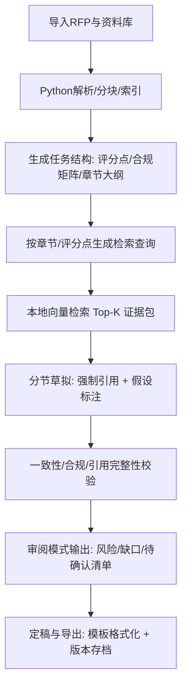

# 基于 Electron + Vue 3 + TypeScript 前端与 Python 本地后端的标书生成桌面工具提示词体系设计

## 产品目标与用户场景分析

从产品设计角度，标书生成工具的核心不是“让模型写得更长”，而是让用户以最小成本完成“可交付、可审阅、可追溯、可复用”的标书产出。你的技术形态（Electron 桌面端 + 本地 Python 后端 + 本地向量检索 + 线上 OpenAI 兼容模型）决定了提示词体系要围绕“本地知识检索 + 证据引用 + 分阶段生成 + 可控一致性”来设计，而不是“把整份资料丢给模型一次写完”。

### 目标用户与典型工作流

在企业标书环境中，常见角色与任务链如下：

标书团队通常从 RFP/招标文件开始，导入与解析后形成“需求清单/合规矩阵”，再基于历史资料库进行检索与复用，生成初稿，最后经历多轮审阅（技术、商务、法务、领导），确保每个关键陈述都有证据来源、满足格式与评分点。

提示词体系需要覆盖这一链路中三个层级的需求：
- 生产效率：减少从 0 到 1 的写作时间（自动大纲、分节草拟、复用措辞）。
- 质量与可控：减少幻觉与不一致（强制引用、假设标注、风格规范、合规检查）。
- 协作与审阅：支持多角色对同一草稿提出结构化反馈与修改建议（差异比对、风险点、待确认问题、引用缺失）。

### 提示词设计的核心方向

提示词体系的设计方向应体现“产品级约束”：
- **证据优先**：生成必须基于本地检索到的片段（chunks）与明确输入；缺证据就写 TODO/待确认，而不是编造。
- **分阶段链式生产**：把“解析 → 规划 → 检索 → 草拟 → 校验 → 定稿”拆成多个可控步骤，避免一次性长生成导致不可追溯。
- **结构化输出契约**：每一步都输出 JSON 或可解析结构，方便前端展示、审阅、存储与回放。
- **角色化交互**：不同角色需要不同视角的输出（撰写者要可直接粘贴的文本，审阅者要风险与缺口清单，技术专家要技术准确性与证据链）。

## 提示词体系总体架构与交互协议

为了在混合技术栈（Electron/TS + Python）下稳定落地，建议把提示词体系设计为“可组合的 Prompt 模块”，并且明确：哪些信息由 Python 后端提供（解析结果、检索结果、元数据、模板约束），哪些信息由模型产出（大纲、草稿、引用映射、风险与问题）。

### 提示词层级与职责划分

推荐采用四层提示词结构（你在代码中可以映射到 system / developer / user 三类消息，但在产品层面按职责理解更清晰）：

- 全局系统约束（Global Guardrails）：安全、隐私、禁止编造、强制引用、输出格式契约。
- 任务开发者指令（Task Instruction）：当前功能模块（如“生成合规矩阵”/“撰写技术方案章节”）的目标、步骤、评分标准。
- 业务上下文（Business Context）：RFP 摘要、客户信息、项目背景、模板规范、公司能力摘要、写作风格指南。
- 检索证据包（Evidence Pack）：本地向量检索返回的 chunks（含 chunk_id、来源、时间、可信度标签、文本）。

### 数据对象与引用机制设计

为了让“引用管理”可交付，建议你定义一个统一的 Evidence 结构，并在所有生成环节强制使用它：

- 每个检索片段：`chunk_id`（全局唯一）、`source_title`、`source_path`、`page/section`、`text`、`tags`（如“报价”“资质”“案例”“法律条款”）、`confidence`（检索分数或规则评分）
- 模型输出中引用格式：在陈述句末尾追加 `[@chunk_id]`；若一句需要多证据，用 `[@id1,@id2]`
- 模型必须同时输出“引用映射表”（chunk_id → 被引用的句子/段落位置），便于 UI 高亮与审阅

### 推荐的链式流程图



这条链路的价值是：每一步都可显示、可回放、可纠错，并且能被缓存（例如检索与草拟结果），大幅降低“模型一次生成失败就全盘重来”的体验风险。

## 关键功能的结构化提示词模板设计

本节按功能模块给出“可复用模板”。每个模板都包含：输入变量、输出要求、提示词正文。你可以在代码里把它们做成 Prompt Registry，并在 Python 后端统一渲染变量（Jinja2/字符串模板均可）。

### 全局系统提示词模板（所有任务共用）

这是你应用里“统一的系统约束”，建议每次调用都带上（或由你的模型适配层自动注入）。

```text
【SYSTEM】
你是“企业标书生成助手”，目标是帮助用户在遵守合规与保密要求下，基于提供的证据与输入生成可审阅、可追溯的标书内容。

硬性规则：
1) 只能使用【证据包】与【用户输入/模板约束】中出现的信息进行事实性陈述；若证据不足，必须输出“待确认/待补充材料”，禁止编造。
2) 所有关键事实、数据、资质、案例、承诺必须给出引用：在句末使用 [@chunk_id]；没有引用的关键陈述视为缺陷。
3) 输出必须严格遵循【输出格式】要求（JSON 或指定结构），不得输出多余解释文本。
4) 语言：中文；风格：专业、清晰、可审阅；避免夸大与绝对化措辞（如“业内第一/保证100%”），除非证据明确支持。
5) 若发现输入自相矛盾或存在风险条款，必须在“risks”字段中指出。
```

### 模板一：RFP 解析结果的“任务结构化”（合规矩阵/评分点/章节拆解）

使用场景：Python 已完成 PDF/Docx 解析与初步结构抽取（标题层级、条款编号、评分办法），模型负责把它整理成“可执行任务列表”。

**输入变量**
- `{{RFP_OUTLINE}}`：解析出的章节与条款列表
- `{{SCORING_RULES}}`：评分点/响应要求（若有）
- `{{OUTPUT_SCHEMA}}`：你希望存库的 JSON 结构

**输出要求（建议 JSON）**
- `requirements[]`：每条需求包含 `req_id`、`text`、`type`（技术/商务/资质/交付/合规）、`priority`、`deliverable_section`、`verification`（如何证明）
- `open_questions[]`：需向客户澄清的问题
- `risk_flags[]`：潜在风险条款（如罚则、验收、付款条件）

```text
【DEVELOPER】
任务：将 RFP 解析结果整理为“可执行的响应需求清单（合规矩阵）”，用于后续检索与写作编排。

输入：
- RFP结构：{{RFP_OUTLINE}}
- 评分与响应要求：{{SCORING_RULES}}

要求：
- 保留条款编号/原文关键句
- 将每项需求归类（技术/商务/资质/交付/合规）
- 给出建议写入的标书章节位置
- 给出“需要什么证据”来支撑（资质文件/案例/参数表/流程图等）
- 输出 JSON，字段严格按：{{OUTPUT_SCHEMA}}

【USER】
请输出合规矩阵 JSON。
```

### 模板二：检索查询生成（从需求/章节生成可检索的 Query Pack）

使用场景：对每个需求或章节，模型生成多种检索 query（关键词、同义扩展、英文缩写、公司内部术语），由 Python 后端调用向量库检索。

**输入变量**
- `{{REQ_ITEM}}`：某条需求（含 req_id、text、type）
- `{{DOMAIN_TERMS}}`：行业术语表（可选）
- `{{CORP_TAXONOMY}}`：公司资料分类体系（可选，如“案例/资质/产品/交付流程/安全合规”）

**输出要求**
- `queries[]`：每条 query 含 `query_text`、`intent`（找案例/找资质/找参数/找流程/找条款）、`filters`（建议加的元数据过滤，如年份/行业/地区）
- `must_have_evidence_types[]`：必须检索到的证据类型

```text
【DEVELOPER】
任务：为以下需求生成检索查询包（Query Pack），用于本地向量检索与元数据过滤。

需求项：
{{REQ_ITEM}}

可用术语/分类（可选）：
- 行业术语：{{DOMAIN_TERMS}}
- 内部分类：{{CORP_TAXONOMY}}

要求：
1) 输出 6-10 条 queries，覆盖：核心关键词、同义表达、缩写/英文、结果导向（如“交付流程/验收/安全/资质证书编号”）
2) 每条 query 给出 intent 与建议 filters（如 doc_type=案例/资质，year>=2022，industry=金融 等）
3) 不要生成与需求无关的泛查询
4) 输出 JSON：{ "req_id": "...", "queries": [...], "must_have_evidence_types": [...] }

【USER】
生成该需求的 Query Pack。
```

### 模板三：证据选择与引用计划（从 Top-K 检索结果挑“可用证据”并规划引用）

使用场景：Python 检索返回 Top-K chunks。模型负责挑选哪些 chunk 用于该章节、哪些不足、哪些需要补证据。

**输入变量**
- `{{SECTION_GOAL}}`：章节目标（如“技术方案-总体架构”）
- `{{EVIDENCE_PACK}}`：检索结果数组（含 chunk_id 与文本）
- `{{STYLE_GUIDE}}`：风格规范（可选）
- `{{MAX_CITATIONS_PER_PARAGRAPH}}`：引用密度约束（可选）

**输出要求**
- `selected_evidence[]`：chunk_id 与用途（支持哪个子论点）
- `gaps[]`：缺口（需要补什么材料）
- `claim_plan[]`：将要写的关键陈述列表，每条绑定至少一个 chunk_id

```text
【DEVELOPER】
任务：基于证据包，为章节写作制定“证据选择与陈述计划”。你不是直接写正文，而是输出可执行的写作计划。

章节目标：
{{SECTION_GOAL}}

证据包（Top-K）：
{{EVIDENCE_PACK}}

要求：
1) 选择最相关且可信的证据片段（最多 8 个），并标注每个证据支持的子论点
2) 列出缺口：哪些关键点没有证据，建议补充什么资料或向谁索取
3) 生成 claim_plan：每条陈述必须绑定至少一个 chunk_id，避免后续写作无引用
4) 输出 JSON：{ "selected_evidence": [...], "gaps": [...], "claim_plan": [...] }

【USER】
请输出该章节的证据选择与陈述计划。
```

### 模板四：分节草拟（强制引用 + 假设/待确认标注）

使用场景：在有 claim_plan 与 selected_evidence 后，生成可直接粘贴到标书的章节草稿，且每段必须含引用。

**输入变量**
- `{{SECTION_TITLE}}` / `{{SECTION_REQUIREMENTS}}`
- `{{CLAIM_PLAN}}`
- `{{EVIDENCE_PACK_SELECTED}}`
- `{{TEMPLATE_CONSTRAINTS}}`：字数、格式、是否要条列、是否要表格
- `{{TONE}}`：正式/稳健/积极但不夸大

**输出要求**
- 正文 `draft_text`（可 markdown）
- `citations[]`：引用清单（chunk_id 列表）
- `assumptions[]`：写作假设
- `todo[]`：待补证据项

```text
【DEVELOPER】
任务：撰写标书章节草稿。必须遵守“证据优先与强制引用”规则。

章节标题：{{SECTION_TITLE}}
章节要求：{{SECTION_REQUIREMENTS}}
模板约束：{{TEMPLATE_CONSTRAINTS}}
语气：{{TONE}}

陈述计划（每条含引用目标）：{{CLAIM_PLAN}}
可用证据（仅限以下证据）：{{EVIDENCE_PACK_SELECTED}}

写作要求：
1) 每个自然段至少包含 1 个引用 [@chunk_id]；涉及数字/指标/资质/案例的句子必须紧跟引用
2) 如证据不足，写“（待确认：……）”并在 todo 中列出，不得编造
3) 不要出现与证据矛盾的承诺性表达；避免绝对化措辞
4) 输出 JSON：
{
  "draft_text": "...",
  "citations": ["chunk_id", ...],
  "assumptions": [...],
  "todo": [...]
}

【USER】
生成该章节草稿。
```

### 模板五：引用完整性与“幻觉”检查（审阅用）

使用场景：对已生成章节做质量门禁：哪些句子缺引用、哪些引用不支持、哪些陈述超出证据范围、哪些需澄清。

**输入变量**
- `{{DRAFT_TEXT}}`
- `{{EVIDENCE_PACK_USED}}`
- `{{POLICY_RULES}}`：企业合规与话术禁用清单（可选）

**输出要求**
- `missing_citations[]`：缺引用的句子片段
- `weak_support[]`：引用不充分/不匹配
- `overclaims[]`：夸大/超承诺
- `rewrite_suggestions[]`：建议改写（给出替代句）

```text
【DEVELOPER】
任务：对草稿进行“引用与证据一致性”审查，找出缺陷并提出可执行改写建议。

草稿：
{{DRAFT_TEXT}}

使用过的证据包：
{{EVIDENCE_PACK_USED}}

审查规则：
1) 关键事实/数据/能力/案例/承诺必须有引用
2) 引用必须能直接支持对应句子，不得张冠李戴
3) 禁止超出证据范围的夸大承诺
4) 输出 JSON：
{
  "missing_citations": [...],
  "weak_support": [...],
  "overclaims": [...],
  "rewrite_suggestions": [{"original": "...", "suggested": "...", "reason": "..."}]
}

【USER】
请完成审查并输出 JSON。
```

### 模板六：模板编辑与“章节占位符”生成（给模板管理员/高级用户）

使用场景：把用户的标书模板（公司标准模板或客户要求格式）转为可参数化的结构（如 JSON schema 或 markdown 模板），并生成占位符。

**输入变量**
- `{{TEMPLATE_TEXT_OR_OUTLINE}}`
- `{{PLACEHOLDER_RULES}}`：占位符命名规则（如 `{{project_name}}`、`{{company_intro}}`）
- `{{SECTION_SCHEMA_REQUIREMENTS}}`：每章需要哪些字段（可选）

**输出要求**
- `template_structure`：结构化模板
- `placeholders[]`：字段定义、来源（用户输入/检索/生成）
- `validation_rules[]`：校验规则（必填、长度、格式）

```text
【DEVELOPER】
任务：将标书模板整理为可复用、可自动填充的结构，并生成占位符清单与校验规则。

模板输入：
{{TEMPLATE_TEXT_OR_OUTLINE}}

占位符规则：
{{PLACEHOLDER_RULES}}

要求：
1) 输出结构必须能被程序解析（建议 JSON）
2) 每个章节列出必填字段与来源类型：user_input / retrieval / generation / fixed_text
3) 给出校验规则（必填、字数范围、格式要求）
4) 输出 JSON：
{
  "template_structure": {...},
  "placeholders": [...],
  "validation_rules": [...]
}

【USER】
请生成模板结构与占位符清单。
```

## 面向不同用户角色的个性化提示词示例

角色化提示词的关键不是“换一个人设”，而是“换输出重点与输入默认项”。同一个章节生成任务，标书撰写人员需要可直接粘贴的内容，审阅人员需要风险与缺口，技术专家需要准确性与可验证性，产品经理需要进度与依赖项。

下面给出可直接用于“用户输入层”的示例（假设系统与开发者提示词已固定注入）。

### 产品经理（PM）：从 RFP 生成交付计划与风险清单

```text
我需要你把当前 RFP 的合规矩阵转换为“工作分解与负责人建议”，输出：
1) 章节/需求拆分（按技术、商务、资质、交付、合规分类）
2) 每项需要谁提供材料（技术/商务/法务/交付/财务）
3) 高风险条款与需要澄清的问题（优先级排序）
4) 预计完成顺序与关键依赖（如资质文件、案例证明、报价策略）

请用 JSON 输出：
{ "work_breakdown": [...], "owners": [...], "risks": [...], "questions": [...], "timeline_hint": [...] }
```

### 标书撰写人员：生成某章节“可直接提交”的草稿

```text
请根据证据包为《技术方案-总体架构与部署方案》写一版可直接粘贴进标书的正文，要求：
- 900~1200 字
- 分 4 个小节，每小节有小标题
- 每段必须带引用 [@chunk_id]
- 不要写任何没有证据支撑的性能指标；如缺证据，用“（待确认：…）”并列入 todo

输出按系统要求的 JSON。
```

### 审阅人员：做“引用与承诺”审查并给出改写建议

```text
请审阅当前章节草稿，重点检查：
- 是否存在未经证据支持的承诺或夸大表述
- 每个关键结论是否有引用
- 引用是否真正支持该句
- 是否存在风险条款遗漏或表述不严谨

输出：
- 缺引用清单
- 夸大/超承诺清单（严重程度）
- 每条问题给出可直接替换的改写句
按 JSON 输出。
```

### 技术专家：对技术准确性做校验与补证据建议

```text
请以技术专家视角校验该章节是否技术上自洽、可实施。你需要：
1) 标注技术不准确/不完整的地方（引用原句）
2) 给出更准确的技术表述建议（避免绝对化）
3) 指出需要补充的证据类型（架构图、参数表、SLA、验收流程、测试报告等）
4) 如证据包中已有相关内容，请指出应引用哪些 chunk_id

按 JSON 输出：{ "issues": [...], "suggestions": [...], "needed_evidence": [...], "recommended_citations": [...] }
```

## 提示词使用指南与最佳实践

提示词体系要“可运营”，就必须给产品和用户一套可重复的写法规则。下面是针对标书生成场景的最佳实践（偏产品规范与可落地实现）。

### 构造高效提示词的“输入四件套”

每次让模型做高价值输出时，用户输入/系统应尽量包含四类信息（缺一会显著降质）：

- 任务目标：写什么/输出什么（例如“生成技术方案章节草稿”）。
- 约束条件：字数、格式、语气、禁用词、模板结构。
- 证据边界：证据包是否已提供、是否允许“合理推断”、如何处理缺证据（必须 TODO）。
- 验收标准：必须引用、不得夸大、输出必须可解析、必须列出风险/疑问。

你可以把这四件套做成 UI 表单，自动拼装进用户提示词，减少用户写提示词门槛。

### 避免歧义的写法规则

歧义在标书生成中表现为“写得像对但不敢用”。建议默认启用以下规则：

- 对“性能/容量/兼容性/资质/交付周期/报价”这类敏感点，要求“没有证据就不写结论”，只写“待确认”。
- 对“我们具备/我们支持/我们提供”类陈述，要求引用到具体材料（案例、资质、产品手册、SOP），否则在审阅中会被判为幻觉。
- 对模板字段使用明确占位符（例如 `{{项目名称}}`、`{{交付周期}}`），避免模型自行填错。

### 提升生成质量的工程性手段（对产品很关键）

- 把生成拆成小步：先“证据选择与陈述计划”，再“草拟”，最后“审查”。这样用户能在早期发现“证据不足”，而不是写完才发现全是 TODO。
- 强制输出结构：所有关键模块要求 JSON 输出，便于前端 UI 高亮引用与问题定位。
- 缓存策略：对相同的“章节目标 + 证据包摘要 + 模板约束”缓存草稿；对相同 query 缓存检索 Top-K，避免用户反复点击带来成本与波动。
- 版本化提示词：每个模板给 `prompt_version` 字段，便于回归测试与线上问题定位。

### 常见失败模式与对策

失败模式往往不是“模型不聪明”，而是“输入与边界不明确”：

- 失败：生成内容缺引用或引用乱贴。对策：先做 claim_plan，再生成正文；正文生成时要求“每段至少一个引用”，并输出引用映射表。
- 失败：生成夸大承诺。对策：系统提示词中明确禁用绝对化措辞，审阅模板中专门输出 overclaims 并给替换句。
- 失败：不同章节重复/矛盾。对策：引入“术语与承诺统一表”（由 Python 后端维护），生成时注入，审查时检查一致性。

## 提示词清单与可复制模板库

为了便于复制复用，本节给出两种输出：一份“表格索引”（便于查找），以及一份“结构化文本库”（便于直接拷贝进代码仓库）。

### 提示词索引表

| Prompt ID | 模块 | 作用 | 主要输入 | 主要输出 |
|---|---|---|---|---|
| P-000 | 全局系统约束 | 防幻觉、强引用、格式契约 | 证据包规则、输出格式 | 统一行为约束 |
| P-010 | RFP→合规矩阵 | 把解析结果转为任务清单 | RFP 结构、评分点 | requirements/open_questions/risks |
| P-020 | 需求→Query Pack | 生成检索 query 与过滤建议 | 单条需求、术语表 | queries/must_have_evidence |
| P-030 | Top-K→证据计划 | 选择证据并规划陈述 | 证据包、章节目标 | selected_evidence/claim_plan/gaps |
| P-040 | 草拟章节 | 生成可粘贴正文（强引用） | claim_plan、证据包、模板 | draft_text/citations/todo |
| P-050 | 引用一致性审查 | 查缺引用、弱引用、超承诺 | 草稿、证据包 | missing/weak/overclaims/rewrite |
| P-060 | 模板结构化 | 模板→可参数化结构 | 模板文本、占位符规则 | template_structure/placeholders |

### 结构化文本库（建议直接放入项目 `prompts/` 目录）

下面以 YAML 风格给出一个“提示词注册表”示例。你可以在 Python 后端加载它，并用变量渲染器（如 Jinja2）填充 `{{...}}`。

```yaml
P-000:
  name: 全局系统约束
  role: system
  template: |
    你是“企业标书生成助手”，目标是帮助用户在遵守合规与保密要求下，基于提供的证据与输入生成可审阅、可追溯的标书内容。
    规则：
    1) 只能使用【证据包】与【用户输入/模板约束】中的信息进行事实性陈述；缺证据必须写“待确认/待补充材料”，禁止编造。
    2) 所有关键事实、数据、资质、案例、承诺必须给出引用：句末使用 [@chunk_id]。
    3) 输出必须严格遵循【输出格式】要求（JSON 或指定结构），不得输出多余解释文本。
    4) 语言：中文；风格：专业、清晰、可审阅；避免夸大与绝对化措辞。
    5) 发现矛盾或风险条款必须在 risks 字段指出。

P-010:
  name: RFP解析→合规矩阵
  role: developer
  inputs: [RFP_OUTLINE, SCORING_RULES, OUTPUT_SCHEMA]
  template: |
    任务：将 RFP 解析结果整理为“可执行响应需求清单（合规矩阵）”。
    输入：
    - RFP结构：{{RFP_OUTLINE}}
    - 评分与响应要求：{{SCORING_RULES}}
    输出：严格按 {{OUTPUT_SCHEMA}} 的 JSON。
    约束：
    - 保留条款编号与关键句
    - 需求归类（技术/商务/资质/交付/合规）
    - 说明建议写入章节与所需证据类型

P-020:
  name: 需求→检索Query Pack
  role: developer
  inputs: [REQ_ITEM, DOMAIN_TERMS, CORP_TAXONOMY]
  template: |
    任务：为需求生成 Query Pack（6-10条）。
    需求：{{REQ_ITEM}}
    可选术语：{{DOMAIN_TERMS}}
    内部分类：{{CORP_TAXONOMY}}
    输出 JSON：
    { "req_id": "...", "queries": [{"query_text": "...", "intent": "...", "filters": {...}}], "must_have_evidence_types": [...] }

P-030:
  name: Top-K证据→证据选择与陈述计划
  role: developer
  inputs: [SECTION_GOAL, EVIDENCE_PACK]
  template: |
    任务：为章节制定“证据选择与陈述计划”，不要直接写正文。
    章节目标：{{SECTION_GOAL}}
    证据包：{{EVIDENCE_PACK}}
    输出 JSON：
    { "selected_evidence": [...], "gaps": [...], "claim_plan": [{"claim": "...", "cite": ["chunk_id", ...]}] }

P-040:
  name: 分节草拟（强制引用）
  role: developer
  inputs: [SECTION_TITLE, SECTION_REQUIREMENTS, TEMPLATE_CONSTRAINTS, TONE, CLAIM_PLAN, EVIDENCE_PACK_SELECTED]
  template: |
    任务：撰写章节草稿，必须强制引用。
    标题：{{SECTION_TITLE}}
    要求：{{SECTION_REQUIREMENTS}}
    约束：{{TEMPLATE_CONSTRAINTS}}
    语气：{{TONE}}
    计划：{{CLAIM_PLAN}}
    证据：{{EVIDENCE_PACK_SELECTED}}
    规则：
    - 每段至少 1 个引用 [@chunk_id]
    - 没证据就标“待确认”，并列入 todo
    输出 JSON：
    { "draft_text": "...", "citations": [...], "assumptions": [...], "todo": [...] }

P-050:
  name: 引用与承诺审查
  role: developer
  inputs: [DRAFT_TEXT, EVIDENCE_PACK_USED]
  template: |
    任务：审查草稿的引用完整性与证据一致性。
    草稿：{{DRAFT_TEXT}}
    证据：{{EVIDENCE_PACK_USED}}
    输出 JSON：
    { "missing_citations": [...], "weak_support": [...], "overclaims": [...], "rewrite_suggestions": [{"original": "...", "suggested": "...", "reason": "..."}] }

P-060:
  name: 模板结构化与占位符生成
  role: developer
  inputs: [TEMPLATE_TEXT_OR_OUTLINE, PLACEHOLDER_RULES]
  template: |
    任务：将模板整理为可解析结构，生成占位符与校验规则。
    模板：{{TEMPLATE_TEXT_OR_OUTLINE}}
    占位符规则：{{PLACEHOLDER_RULES}}
    输出 JSON：
    { "template_structure": {...}, "placeholders": [...], "validation_rules": [...] }
```

---

这套提示词体系的核心产品价值在于：把“标书写作”从一次性、不可控的长生成，转为可视化、可审阅、可追溯的链式流程；并通过强引用与结构化输出，让 Electron 前端能稳定呈现证据链、让 Python 后端能缓存与回放，从而真正落地到企业标书协作场景。